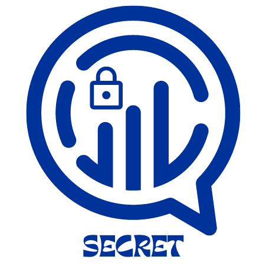

<div align="center">
  
  <h1><code>go-secret</code></h1>
  <p>
    <strong>A self-destructive message sharing applications</strong>
  </p>
</div>

Secret is use to share messages and delete them after the messages are read.

## Development

To get started, you can clone the repository and run the following commands:

```bash
git clone https://github.com/mrinjamul/go-secret.git
```

To install the dependencies, run the following commands:

```bash
cd go-secret
go mod download
```

To build the UI, run the following commands:

```bash
cd views
npx tailwindcss -i ./static/tailwind-src.css -o ./static/tailwind.css
```

To build the application, run the following commands:

```bash
cp .env.example .env # copy the example env file and set your own values
go build -o secret main.go # build the application
export $(cat .env | xargs) # export the environment variables
./secret # run the application
```
